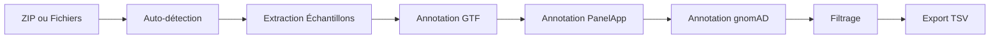

# Annotation for RNAexplorer

<div align="center">


**Pipeline d'annotation pour FRASER2 et OUTRIDER avec support RNAexplorer**

[Documentation](#documentation) •
[Installation](#installation) •
[Utilisation](#utilisation-rapide) •
[Exemples](#exemples)

</div>

---

## 📖 Description

Pipeline d'annotation complet pour les sorties **FRASER2** et **OUTRIDER** avec intégration automatique des annotations génomiques (GTF, PanelApp, gnomAD). Conçu pour s'intégrer avec RNAexplorer.

### ✨ Fonctionnalités Principales

- 🔍 **Auto-détection** des fichiers FRASER/OUTRIDER depuis un ZIP
- 🧬 **Annotation GTF** pour positions chromosomiques et métadonnées des gènes
- 🏥 **Intégration PanelApp** pour panels de gènes cliniques
- 📊 **Contraintes gnomAD** pour évaluation de la pathogénicité
- 🎯 **Filtrage intelligent** par p-value, z-score, deltaPsi
- 📁 **Export TSV** avec annotations complètes
- 🚀 **Mode interactif** pour sélection manuelle des fichiers
- ✅ **Tests intégrés** pour validation du pipeline

---

## 🚀 Installation

### Prérequis

- Python 3.8+
- pip
- Git (recommandé)

### Installation Rapide

```bash
# Cloner le repository
git clone https://github.com/YOUR-USERNAME/annotation_for_RNAexplorer.git
cd annotation_for_RNAexplorer

# Lancer l'installation automatique
bash setup.sh
```

### Installation Manuelle

```bash
# Installer les dépendances
pip install -r requirements.txt

# Tester l'installation
python test_pipeline.py
```

---

## 🔧 Utilisation Rapide

### Option 1 : Depuis un ZIP (Recommandé)

```bash
python analyze_from_zip.py \
  --zip results.zip \
  --samples samples.txt \
  --gtf genes.gtf \
  --output results/
```

### Option 2 : Chemins Directs

```bash
python rnaseq_analysis.py \
  --fraser fraser.tab \
  --outrider outrider.tab \
  --samples samples.txt \
  --gtf genes.gtf \
  --output results/
```

Voir [QUICKSTART.md](QUICKSTART.md) pour plus de détails.

---

## 📊 Workflow



---

## 📂 Structure du Projet

```
annotation_for_RNAexplorer/
├── analyze_from_zip.py      # Analyseur ZIP avec auto-détection
├── rnaseq_analysis.py        # Pipeline principal
├── scripts/
│   ├── filter_variants.py    # Filtrage et priorisation
│   └── download_panelapp.py  # Téléchargement PanelApp
├── test_pipeline.py          # Suite de tests
├── setup.sh                  # Installation automatique
├── git_setup.sh              # Configuration Git
└── docs/
    ├── README.md             # Ce fichier
    ├── QUICKSTART.md         # Guide de démarrage
    ├── ADVANCED_USAGE.md     # Exemples avancés
    └── GIT_INTEGRATION.md    # Guide Git
```

---

## 📋 Exemples

### Exemple 1 : Analyse Basique

```bash
python analyze_from_zip.py \
  --zip /data/run_2024/results.zip \
  --samples samples.txt \
  --gtf gencode.v44.gtf \
  --output results/
```

### Exemple 2 : Avec Annotations Complètes

```bash
python rnaseq_analysis.py \
  --fraser fraser.tab \
  --outrider outrider.tab \
  --samples samples.txt \
  --gtf gencode.v44.gtf \
  --panelapp panelapp_genes.tsv \
  --gnomad gnomad_constraints.tsv \
  --output results/ \
  --verbose
```

### Exemple 3 : Filtrage des Variants

```bash
python scripts/filter_variants.py \
  --input results/fraser_annotated.tsv \
  --output results/ \
  --padjust 0.01 \
  --deltapsi 0.5 \
  --prioritize
```

Voir [ADVANCED_USAGE.md](ADVANCED_USAGE.md) pour plus d'exemples.

---

## 📚 Documentation

| Document | Description |
|----------|-------------|
| [QUICKSTART.md](QUICKSTART.md) | Guide de démarrage rapide |
| [README.md](README.md) | Documentation complète |
| [ZIP_USAGE.md](ZIP_USAGE.md) | Utilisation avec fichiers ZIP |
| [ADVANCED_USAGE.md](ADVANCED_USAGE.md) | Cas d'usage avancés |
| [GIT_INTEGRATION.md](GIT_INTEGRATION.md) | Intégration Git/GitHub |

---

## 🧪 Tests

```bash
# Lancer les tests
python test_pipeline.py

# Tests avec données réelles
python analyze_from_zip.py \
  --zip test_data.zip \
  --samples test_samples.txt \
  --gtf test.gtf \
  --output test_results/ \
  --verbose
```

---

## 🛠️ Prérequis de Données

### Fichiers Requis

1. **Sorties FRASER2** : Format TSV avec colonnes `sampleID`, `hgncSymbol`, `pValue`, `deltaPsi`
2. **Sorties OUTRIDER** : Format TSV avec colonnes `geneID`, `sampleID`, `zScore`, `pValue`
3. **Fichier GTF** : GENCODE ou Ensembl
4. **Liste d'échantillons** : Un ID par ligne

### Fichiers Optionnels

- **PanelApp** : Annotations de panels cliniques
- **gnomAD** : Contraintes génétiques (pLI, LOEUF)

### Télécharger les Références

```bash
# GTF GENCODE
wget https://ftp.ebi.ac.uk/pub/databases/gencode/Gencode_human/release_44/gencode.v44.annotation.gtf.gz
gunzip gencode.v44.annotation.gtf.gz

# gnomAD
wget https://storage.googleapis.com/gcp-public-data--gnomad/release/2.1.1/constraint/gnomad.v2.1.1.lof_metrics.by_gene.txt.bgz
gunzip gnomad.v2.1.1.lof_metrics.by_gene.txt.bgz

# PanelApp
python scripts/download_panelapp.py --output panelapp_data/
```

---

## 🤝 Contribution

Les contributions sont les bienvenues ! Voir [CONTRIBUTING.md](CONTRIBUTING.md).

### Comment Contribuer

1. Fork le projet
2. Créer une branche (`git checkout -b feature/amazing-feature`)
3. Commit les changements (`git commit -m 'Add amazing feature'`)
4. Push vers la branche (`git push origin feature/amazing-feature`)
5. Ouvrir une Pull Request

---

## 📄 Licence

Ce projet est sous licence MIT. Voir [LICENSE](LICENSE) pour plus de détails.

---

## 🙏 Remerciements

Ce pipeline utilise :

- **FRASER2** pour l'analyse de splicing aberrant
- **OUTRIDER** pour la détection d'expression aberrante
- **PanelApp** de Genomics England
- **gnomAD** du Broad Institute
- **GENCODE/Ensembl** pour les annotations génomiques

---

## 📞 Support

- 📖 [Documentation complète](README.md)
- 🐛 [Rapporter un bug](../../issues/new?template=bug_report.md)
- 💡 [Suggérer une fonctionnalité](../../issues/new?template=feature_request.md)
- 📧 Contact : [Ouvrir une issue](../../issues)

---

## 🔗 Liens Utiles

- [Documentation FRASER](https://github.com/gagneurlab/FRASER)
- [Documentation OUTRIDER](https://github.com/gagneurlab/OUTRIDER)
- [PanelApp](https://panelapp.genomicsengland.co.uk/)
- [gnomAD](https://gnomad.broadinstitute.org/)
- [GENCODE](https://www.gencodegenes.org/)

---

<div align="center">

**Développé avec ❤️ pour la communauté bioinformatique**

⭐ Si ce projet vous est utile, n'hésitez pas à lui donner une étoile !

</div>
